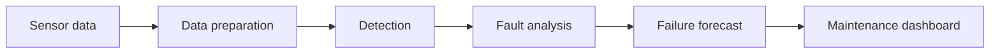

# RailPulse

**Real-time predictive maintenance for train door and bogie systems**

RailPulse is a train condition-monitoring system that turns sensor readings into practical maintenance information. It detects abnormal behaviour, shows which measurements contributed to an alert, and estimates how urgently a component requires attention.

The prototype also includes a physical train-door rig that demonstrates the monitoring pipeline using live sensor readings.

---

## Problem

Train doors and bogie components produce large amounts of operational data, but raw sensor readings are difficult to interpret quickly.

A maintenance engineer needs clear answers:

* Is the component behaving abnormally?
* Which signals caused the alert?
* Which component requires attention?
* Is its condition becoming worse?
* How urgently should it be inspected?

RailPulse brings these results into one interface instead of requiring operators to inspect separate datasets and model outputs.

---

## Solution

RailPulse processes train sensor data through three analytical stages:

1. **Detect** abnormal operating behaviour.
2. **Explain** the measurements contributing to the detected condition.
3. **Forecast** degradation and maintenance urgency.

The results are displayed through an engineering dashboard with selectable trains, components, telemetry graphs, inspection views and maintenance recommendations.



---

## Main Features

### Fleet Overview

* Displays the condition of monitored trains
* Shows normal and attention-required assets
* Provides door availability and latest update time
* Allows operators to select individual trains and components
* Presents one clear maintenance recommendation

### Anomaly Detection

* Monitors live sensor readings
* Compares measurements with their normal operating ranges
* Highlights threshold exceedances
* Supports different telemetry time ranges
* Records recent sensor events

### Fault Analysis

* Shows the measurements that contributed to an alert
* Compares observed values against normal ranges
* Highlights the component that should be inspected first
* Presents model feature contributions
* Separates model evidence from confirmed physical findings

### Failure Forecast

* Tracks how predicted fault risk changes over time
* Compares the latest prediction with an action threshold
* Shows the model’s prediction window
* Provides a recommended maintenance response
* Maintains a history of recent model outputs

### Physical Demonstration

A train-door mechanism is used to demonstrate the system with live sensor input. Changes in the rig’s operating condition are passed through the monitoring pipeline and reflected on the dashboard.

This allows the prototype to demonstrate a responding system rather than only showing fixed dashboard values.

---

## Dashboard Structure

```text
Overview
├── Train and component selection
├── Fleet condition summary
├── Train condition map
└── Maintenance alert

Anomaly Detection
├── Live telemetry
├── Normal operating range
├── Threshold events
├── Component scanner
└── Recent events

Fault Analysis
├── Mechanical inspection view
├── Feature contributions
├── Supporting measurements
└── Recommended inspection point

Failure Forecast
├── Fault-risk history
├── Action threshold
├── Operational recommendation
└── Prediction history
```

---

## Model Pipeline

The modelling workflow is designed to support train door and bogie condition monitoring.

### 1. Data Preparation

Sensor files are cleaned and aligned by timestamp and asset identifier. Rolling statistics and lagged values are created to represent recent operating behaviour.

Examples include:

* Rolling mean
* Rolling standard deviation
* Minimum and maximum values
* Previous sensor readings
* Cycle duration
* Change from normal operating behaviour

### 2. Anomaly Detection

The detection stage identifies operating cycles that differ from normal historical behaviour.

Its output is used to flag unusual sensor patterns for further analysis.

### 3. Fault Analysis

The analysis stage estimates fault probability and identifies the measurements that had the strongest influence on the result.

Feature contributions are presented as supporting evidence. They do not replace physical inspection.

### 4. Failure Forecast

The forecasting stage evaluates recent sensor trends to estimate future risk or threshold breaches.

The exact forecast target and evaluation method will be finalised according to the released dataset and submission specification.

---

## Technology Stack

### Machine Learning and Data Processing

* Python
* Pandas
* NumPy
* Scikit-learn
* XGBoost
* SHAP

### Web Application

* Flask
* Jinja
* HTML
* Modular CSS
* JavaScript
* SVG charts

### Development Tools

* Jupyter Notebook
* Visual Studio Code
* Git and GitHub

The final production model will be selected after comparing candidate models on the released training data. Model choice will be based on validation performance rather than using every model automatically.

---

## Project Structure

```text
RailPulse/
├── app.py
├── requirements.txt
├── README.md
│
├── templates/
│   ├── base.html
│   ├── dashboard.html
│   ├── anomaly.html
│   ├── diagnosis.html
│   └── forecast.html
│
├── static/
│   ├── css/
│   │   ├── tokens.css
│   │   ├── reset.css
│   │   ├── base.css
│   │   ├── navigation.css
│   │   ├── components.css
│   │   ├── charts.css
│   │   ├── overview.css
│   │   ├── signals.css
│   │   ├── explanation.css
│   │   └── prediction.css
│   │
│   ├── js/
│   │   ├── api.js
│   │   ├── overview.js
│   │   ├── signals.js
│   │   ├── explanation.js
│   │   └── prediction.js
│   │
│   ├── train-logo.png
│   └── railbot-avatar.png
│
├── notebooks/
│   └── railpulse_pipeline.ipynb
│
├── data/
│   ├── raw/
│   └── processed/
│
├── models/
│
└── predictions/
```

---

## Installation

### 1. Clone the repository

```bash
git clone <repository-url>
cd RailPulse
```

### 2. Create a virtual environment

Windows:

```bash
python -m venv venv
venv\Scripts\activate
```

macOS or Linux:

```bash
python3 -m venv venv
source venv/bin/activate
```

### 3. Install the required packages

```bash
pip install -r requirements.txt
```

### 4. Run the Flask application

```bash
python app.py
```

Open the following address in a browser:

```text
http://127.0.0.1:5000
```

---

## Application Routes

| Route        | Page              |
| ------------ | ----------------- |
| `/`          | Fleet Overview    |
| `/anomaly`   | Anomaly Detection |
| `/diagnosis` | Fault Analysis    |
| `/forecast`  | Failure Forecast  |

---

## Data Integration

The current interface can operate with demonstration data while the modelling pipeline is being developed.

Once the final model output is available, the frontend will read a consistent result containing:

* Train and component identifiers
* Sensor measurements
* Normal operating ranges
* Anomaly or fault probability
* Important contributing signals
* Forecast window
* Risk level
* Recommended maintenance action
* Prediction timestamp

Demonstration values must be replaced with model-generated results before final evaluation.

---

## Prediction Outputs

Submission files will follow the exact filenames, columns and data types specified by the organisers.

Before packaging the final results, the team will validate:

* Required filenames
* Column names
* Row count
* Asset identifiers
* Timestamp format
* Prediction data type
* Missing values
* Output folder structure

The final output folder will be packaged as:

```text
predictions.zip
```

---

## Model Evaluation

The final metrics will depend on the released task and label format.

Possible evaluation measures include:

### Classification

* Precision
* Recall
* F1-score
* PR-AUC
* Confusion matrix

### Regression and Forecasting

* Mean absolute error
* Root mean squared error
* Threshold-breach accuracy

For highly imbalanced fault data, PR-AUC, recall and precision will be prioritised over accuracy alone.

---

## Current Status

* [x] Flask application structure
* [x] Shared navigation and design system
* [x] Fleet Overview interface
* [x] Anomaly Detection interface
* [x] Fault Analysis interface
* [x] Failure Forecast interface
* [ ] Interactive demonstration controls
* [ ] Final dataset integration
* [ ] Model comparison and selection
* [ ] Flask prediction API
* [ ] Physical sensor integration
* [ ] Submission-file validation
* [ ] Hosted prototype
* [ ] Final demonstration video

---

## Team

| Member | Responsibility                               |
| ------ | -------------------------------------------- |
| Ren    | Data preparation and model development       |
| May    | RailBot and dashboard integration            |
| Thuzar | Dashboard, interface design and presentation |

---

## Project Links

* **Repository:** `<GitHub repository URL>`
* **Hosted prototype:** `<Prototype URL>`
* **Demonstration video:** `<Video URL>`

---

## Important Note

RailPulse is a decision-support prototype. Its predictions identify patterns that may require attention, but maintenance decisions should still be confirmed through engineering inspection and established railway maintenance procedures.
